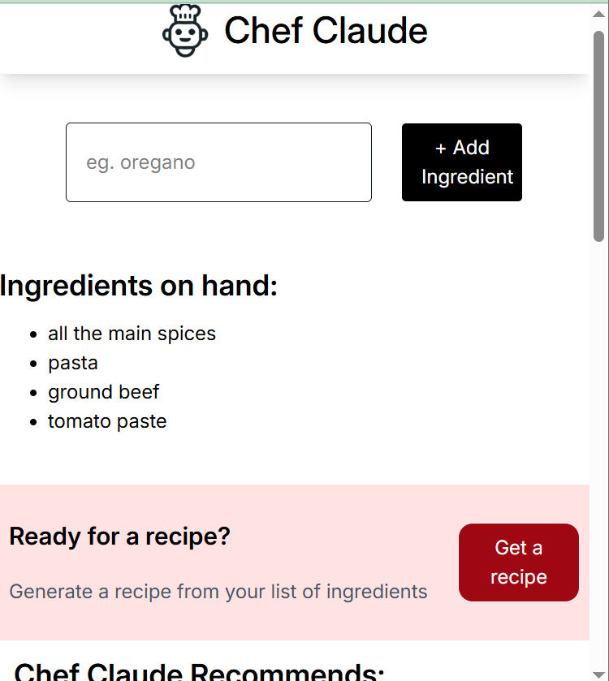

# AI Recipe Generator (Chef Claude)

An interactive React application that suggests recipes based on a list of ingredients you provide.  
It uses Hugging Face's **Mistral AI model** to generate creative, markdown-formatted recipes.

---

## Features
- **Add Ingredients**: Input any ingredients you have on hand.
- **AI Recipe Suggestion**: Uses Hugging Face Inference API to suggest recipes using some or all provided ingredients.
- **Interactive UI**: React components update dynamically when new ingredients are added.
- **Markdown Recipe Output**: AI returns responses in markdown format (ready for styling).

---

## 🛠Technologies Used
- **React** (Vite) for the front-end
- **TailwindCSS** for styling
- **Hugging Face Inference API** (`@huggingface/inference`) for AI-powered recipe generation
- **JavaScript (ES6)** with modern async/await syntax

---

## Installation & Setup

1. **Clone the repository**
```bash
git clone https://github.com/Molo-M/chef-claude-project.git
cd chef-claude-project
````

2. **Install dependencies**

```bash
npm install
```

3. **Set up environment variables**
   Create a `.env` file in the root directory and add:

```env
VITE_HF_ACCESS_TOKEN=your_huggingface_api_key_here
```

> You can get an API key from [Hugging Face](https://huggingface.co/settings/tokens).

4. **Run the development server**

```bash
npm run dev
```

---

## Usage

1. Open the app in your browser.
2. Enter an ingredient in the text box and click **+ Add Ingredient**.
3. Repeat for all ingredients you have.
4. Click **"Get a recipe"** to fetch a suggestion from the AI.
5. The recipe will be displayed below the ingredient list.

---

## How It Works

* When you click **"Get a recipe"**, the app:

  1. Joins the list of ingredients into a single string.
  2. Sends the string to Hugging Face’s **Mistral-7B-Instruct** model with a system prompt.
  3. Waits for the AI's markdown-formatted recipe.
  4. Formats the markdown-formatted recipe into html elements using **React-Markdown**.
  5. Displays the AI response in the `ClaudeRecipe` component.

---

## 📸 Screenshot

> 

---

## 🛡️ License

This project is licensed under the MIT License.

---


